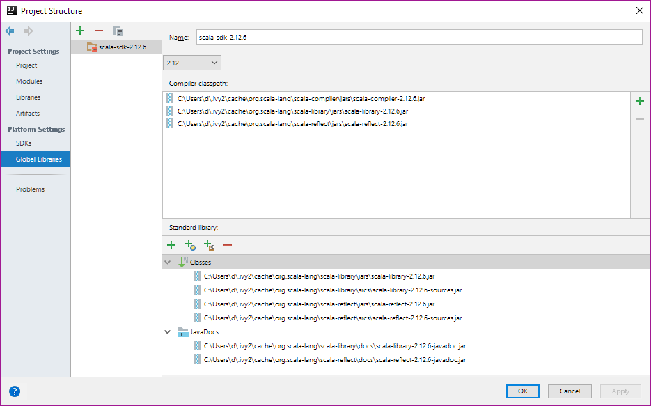
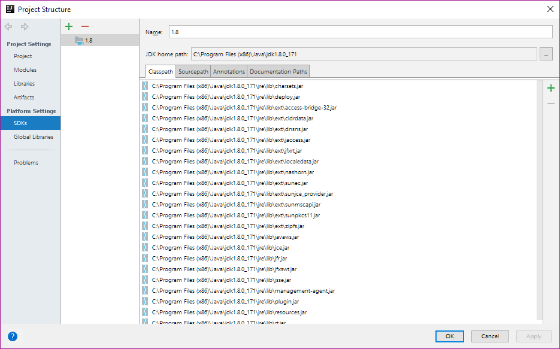
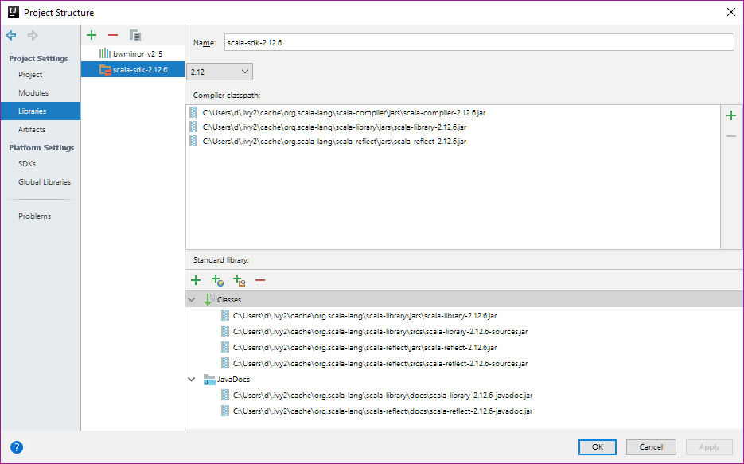
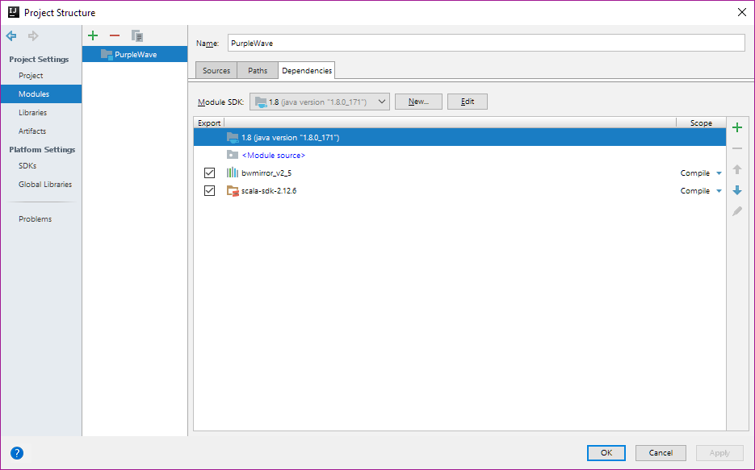
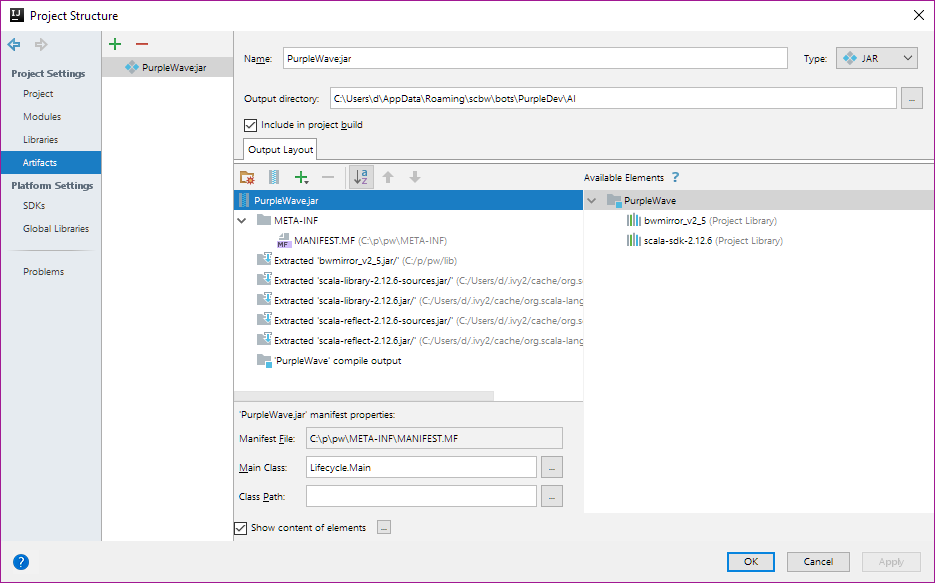

# Building PurpleWave

## Get Started

What you'll need:
* Windows 
* 32-bit (x86) Java Runtime Environment 8: http://www.oracle.com/technetwork/java/javase/downloads/jre8-downloads-2133155.html
* 32-bit (x86) Java Development Kit 8:http://www.oracle.com/technetwork/java/javase/downloads/jdk8-downloads-2133151.html
* IntelliJ IDEA Community Edition: https://www.jetbrains.com/idea/download/#section=windows

## Configuring IntelliJ project

Some of these steps may already be complete. If so, great!

### Add Scala plugin
* Open IntelliJ.
* If a project is open, close it with File -> Close Project
* File -> Settings -> Plugins -> Install JetBrains Plugin -> Scala -> Install
* Open -> Select the PurpleWave directory (the one with with ".idea" in it) -> OK

### Add global Scala library
* File -> Project Structure -> Global Libraries
* **Verify:** You should see "scala-sdk-2.12.6"
* If you don't see this: Click "+" -> "Scala SDK" -> Download... -> Version: 2.12.6 -> OK -> OK

### Select Java SDK
* File -> Project Structure -> SDKs
* **Verify:** You should see 1.8 listed
* **Verify:** You should see "JDK Home Path" pointing to your 32-bit JDK
* If you don't see this: Click "+" -> Select directory of 32-bit JDK
* **Note** It's important to pick the 32-bit JDK and not the 64-bit JDK. The 32-bit JDK is usually in "Program Files (x86)" and the 64-bit JDK is in "Program Files".

### Add project Scala library
* File -> Project Structure -> Libraries
* **Verify:** You should see "scala-sdk-2.12.6"
* **Verify:** You should see "bwmirror_v2_5"
* If you don't see Scala: Click "+" -> Select Scala 2.12.6 -> OK
* If you don't see BWMirror: Click "+" -> Select Java -> Navigate to bwmirror_v2_5.jar -> OK

### Add Modules
* File -> Project Structure -> Modules -> Dependencies
* **Verify:** You should see "PurpleWave"
* **Verify:** You should see bwmirror_v2_5, with "Export" checked off
* **Verify:** You should see scala-sdk-2.12.6, with "Export" checked off

### Configure Artifacts

* File -> Project Structure -> Modules -> Artifacts
* **Verify:** You should see a listing for PurpleWave.jar
* **Verify:** You should see "Include in project build" checked
* **Verify:** You should see, under "Output Layout":
    - META-INF. Expanding it should show MANIFEST.MF
    - bwmirror_v2_5.jar
    - scala-library-2.12.6.jar
    - scala-reflect-2.12.6.jar
    - PurpleWave compile output
* Under "Output Layout", select PurpleWave.jar
* **Verify:** "Manifest File" should point to META-INF\MANIFEST.MF
* **Verify:** "Main Class" should be "Lifecycle.Main"
* Next to "Output directory", click "..." and choose a directory for PurpleWave's build output

### Build

You should be ready to build!
* Build -> Build Artifacts -> Build
* This should produce PurpleWave.jar in the directory you specified earlier

## Running PurpleWave

* Find the path of your 32-bit Java.exe (likely in c:\Program Files (x86)\, not c:\Program Files|)
* Open a command prompt (cmd.exe, not PowerShell). Substitute your Java.exe path.
`
C:\Program Files (x86)\Java\jre1.8.0_171\bin\java.exe" -jar C:\Users\d\AppData\Roaming\scbw\bots\PurpleDev\AI\PurpleWave.jar
`
* You'll know it's working if you see "Connecting to Broodwar" likely followed by "No server proc ID"
* You're now ready to connect to BWAPI 4.1.2! See [BWAPI documentation](https://github.com/bwapi/bwapi) for running it with client bots like PurpleWave.
    
You can also run PurpleWave directly from IntelliJ with Run -> Run 'PurpleWave'